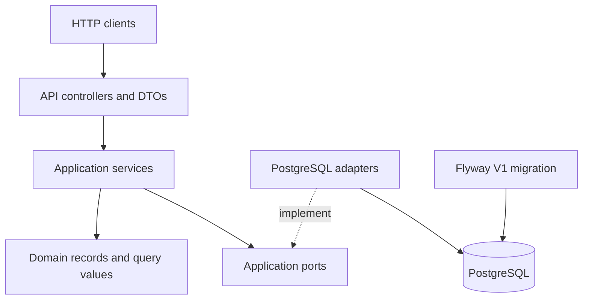
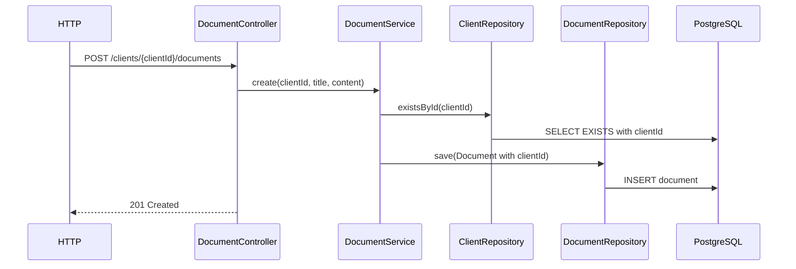

# Nevis Search Service — As-Built Architecture

> Status: implementation architecture as of 2026-08-18.
>
> The original agreed plan is preserved unchanged in
> [`IMPLEMENTATION_PLAN.md`](IMPLEMENTATION_PLAN.md). The narrower client-search requirements in
> [`CLIENT_SEARCH_PLAN.md`](CLIENT_SEARCH_PLAN.md) supersede the original plan for that capability.
> [`search-api-cleanup-plan.md`](search-api-cleanup-plan.md) supersedes it for the removed
> client-specific document `GET` endpoint.
> This document describes the code that actually exists in the repository.

## 1. Implemented scope

The service implements:

- client creation;
- creation of text documents owned by a client;
- global client and document search through a typed result array;
- deterministic client discovery only by company keys derived from corporate email domains;
- deterministic business-term expansion backed by PostgreSQL;
- Flyway-managed PostgreSQL schema and seed data;
- OpenAPI/Swagger documentation;
- Docker Compose runtime configuration;
- unit tests and PostgreSQL/Testcontainers integration tests.

The optional document-summary capability was not implemented. No functionality from the plan's
non-goals was introduced.

## 2. Technology baseline

| Area | Implemented choice |
|---|---|
| Language | Java 25 |
| Framework | Spring Boot 4.1.0 / Spring Framework 7 |
| Build | Maven |
| HTTP | Spring MVC with embedded Tomcat |
| Database access | Spring `JdbcClient` |
| Source of truth | PostgreSQL 17.6 image in local/test configuration |
| Schema management | Flyway |
| Document search | PostgreSQL FTS (`tsvector`, `websearch_to_tsquery`, `ts_rank_cd`) |
| API documentation | springdoc-openapi 3.0.3 / Swagger UI |
| Database tests | Testcontainers 2.0.5 with PostgreSQL 17.6 |
| Local orchestration | Docker Compose |

## 3. Architecture overview

The code is a lightweight ports-and-adapters application. Spring dependency injection performs the
runtime wiring, but application services depend only on application ports and domain types.



Dependency direction in source code:

```text
api -> application -> application.port + domain
infrastructure.postgres -> application.port + domain
```

The `application`, `domain`, and `api` packages do not contain SQL or import `JdbcClient`.
PostgreSQL-specific FTS syntax remains under `infrastructure.postgres` and in Flyway migrations.

## 4. Package and component map

### `com.nevis.search.api`

| Component | Responsibility |
|---|---|
| `ClientController` | `POST /clients` |
| `DocumentController` | document creation for an explicit client |
| `SearchController` | global client/document search facade |
| `ApiExceptionHandler` | consistent `400`, `404`, and safe `500` responses |
| `api.dto` | validated request DTOs and external response models |

API DTOs are separate from domain records. Global search uses the sealed
`SearchResultResponse` hierarchy with the `CLIENT` / `DOCUMENT` discriminator.
The external contract uses `first_name` and `last_name` for client names and `client_id` and
`created_at` for document ownership/timestamps. `countryOfResidence` remains camelCase as specified
by the supplied contract. Java records keep idiomatic camelCase component names, with Jackson
annotations defining the wire representation; legacy camelCase client-name request fields remain
accepted as aliases.

### `com.nevis.search.application`

| Component | Responsibility |
|---|---|
| `ClientService` | creates clients and delegates persistence |
| `DocumentService` | verifies client existence and creates documents |
| `SearchService` | orchestrates global client and all-client document search |
| `QueryNormalizer` | canonicalizes and validates raw queries |
| `ClientSearchQueryNormalizer` | converts company queries to exact comparison keys |
| `QueryExpander` | combines the original query with explicit related business terms |

`ClientNotFoundException` and `InvalidRequestException` represent expected application failures.

### `com.nevis.search.application.port`

| Port | Capability |
|---|---|
| `ClientRepository` | client persistence and existence checks |
| `DocumentRepository` | document persistence |
| `ClientSearchPort` | exact company-domain client discovery |
| `DocumentSearchPort` | ranked all-client document search |
| `QueryExpansionPort` | lookup of related business terms |

CRUD and search remain separate capabilities even though PostgreSQL currently implements both.

### `com.nevis.search.infrastructure.postgres`

| Adapter | Implementation detail |
|---|---|
| `PostgresClientRepository` | JDBC client inserts/lookups |
| `PostgresDocumentRepository` | JDBC document inserts |
| `PostgresClientSearchAdapter` | exact company-key matching derived from email domains |
| `PostgresDocumentSearchAdapter` | PostgreSQL FTS and ranking |
| `PostgresQueryExpansionAdapter` | group lookup in `search_term_mapping` |

## 5. Domain model and ownership

The implemented domain records are:

```text
Client
  id: UUID
  firstName: String
  lastName: String
  email: String
  countryOfResidence: String?

Document
  id: UUID
  clientId: UUID
  title: String
  content: String
  createdAt: Instant
```

Every `Document` carries a non-null `clientId`. The database foreign key guarantees that the owner
exists.

There is no Tenant entity, hidden client context, `ThreadLocal`, authentication scope, RLS, or
database-per-client routing.

Client search uses a separate `ClientSearchQuery` value containing the normalized company key.

## 6. PostgreSQL schema

`V1__initial_schema.sql` is the sole owner of the initial schema.

### `clients`

- UUID primary key;
- bounded first name, last name, email, and optional country;
- email is deliberately not unique because the task did not define that invariant.

### `documents`

- UUID primary key;
- mandatory `client_id` foreign key to `clients`;
- title, text content, and `TIMESTAMPTZ` creation time;
- stored generated `search_vector`;
- title tokens have weight `A` and content tokens have weight `B`;
- GIN index on `search_vector`;
- B-tree index on `client_id`.

The generated expression uses the PostgreSQL `english` text-search configuration.

### `search_term_mapping`

The table has `group_key`, `term`, and `normalized_term`, with a primary key on
`(group_key, normalized_term)`. Flyway seeds one `proof_of_address` group:

```text
address proof
proof of address
proof of residency
utility bill
bank statement
```

Adding a term requires one row rather than pairwise synonym mappings.

## 7. Search design

### 7.1 Query normalization

`QueryNormalizer`:

1. rejects null or blank input;
2. trims and lowercases with `Locale.ROOT`;
3. converts `-`, `_`, `/`, and `\` separators to spaces;
4. collapses repeated whitespace;
5. requires at least one letter or digit;
6. enforces `MAX_QUERY_LENGTH`, default `200`.

`ClientSearchQueryNormalizer` separately normalizes a human company query by trimming it,
lowercasing it with `Locale.ROOT`, and removing whitespace. It does not remove other punctuation or
apply fuzzy matching. Thus all of these produce `neviswealth`:

```text
Nevis Wealth
nevis wealth
NEVIS WEALTH
neviswealth
```

### 7.2 Business-term expansion

`QueryExpander` always includes the normalized original term. The PostgreSQL expansion adapter
finds a matching mapping group and returns every term in that group. A `LinkedHashSet` deduplicates
the result. Expansion is one level only and performs no fuzzy or recursive inference.

### 7.3 Client search

`PostgresClientSearchAdapter` validates the stored email shape defensively, extracts the domain,
lowercases it, and removes its final top-level-domain segment. For example:

```text
Nevis Wealth -> neviswealth
anton.batiaev@neviswealth.com -> neviswealth.com -> neviswealth
```

Only exact equality between the normalized query and derived company key matches. There is no
contains/prefix/fuzzy matching and no client lookup by first name, last name, or full email. Rows
with malformed email values or domains that cannot produce a key are ignored rather than failing
the entire search. Multiple exact company matches are ordered by last name, first name, and UUID.

### 7.4 Document FTS

`PostgresDocumentSearchAdapter` binds every expanded term as a SQL parameter and converts it with
`websearch_to_tsquery('english', term)`. The terms are evaluated with OR semantics by matching each
document against all generated queries. The maximum `ts_rank_cd` value is used as that document's
relevance.

Ordering is relevance descending, creation time descending, then UUID.

Document FTS is used only by the required global search facade, so its port has no client-scope
parameter or PostgreSQL `client_id` predicate.

## 8. Request flows

### Create document



### Global search

`SearchService` creates a company-specific `ClientSearchQuery`, separately normalizes the document
query, calls `ClientSearchPort`, expands document terms, calls `DocumentSearchPort`, and returns
the two result groups without inventing a shared score. `SearchController`
serializes client results first and document results second. The supplied `limit` applies
independently to each result type, so the response can contain up to twice that number of items.

## 9. HTTP API as implemented

| Method and path | Behaviour |
|---|---|
| `POST /clients` | Creates and returns a client with `201` and `Location` |
| `POST /clients/{clientId}/documents` | Creates a client-owned text document |
| `GET /search?q=...` | Searches clients and all-client documents; supports per-type `limit` |

The configured default limit is `20`, and the configured maximum is `100`.
OpenAPI annotations on the controllers document the actual `201`, `200`, `400`, `404`, and `500`
responses and their response schemas.

Request validation includes bounded names, email syntax, bounded title, non-blank content,
configurable content size, non-blank searchable queries, maximum query length, valid UUIDs, and
valid pagination values.

Expected errors use `ApiError`:

```text
timestamp, status, error, message, path, violations[]
```

Malformed requests and validation failures return `400`. Unknown clients in document operations
return `404`, and unsupported request media types return `415`. Unexpected failures return a
generic `500`; the response does not expose SQL or stack traces.

## 10. Configuration and runtime

`application.yml` maps environment variables for the datasource, server port, query limits, result
limits, and document content limit. Defaults target the Compose PostgreSQL service for the standard
local workflow.

`compose.yaml` defines:

- pinned `postgres:17.6-alpine` with a health check and persistent volume;
- an application image built by the repository `Dockerfile`;
- application port `8080`, mapped to host port `8080` by default and configurable with
  `APP_HOST_PORT`, plus PostgreSQL port `5432` for local database access;
- application startup after PostgreSQL becomes healthy;
- automatic Flyway execution during Spring Boot startup.

The Dockerfile is a multi-stage Java 25 build. The runtime process uses numeric non-root user
`10001`.

## 11. Testing architecture

Pure unit tests cover:

- document-query normalization, separator handling, blank/punctuation-only input, and maximum query
  length;
- company-query case/whitespace normalization and the deliberate absence of fuzzy punctuation rules;
- expansion, original-term preservation, and deduplication;
- global-search orchestration;
- unknown-client document creation and content-size enforcement.

`NevisPostgresIntegrationTest` uses a real PostgreSQL Testcontainer and covers:

- Flyway migrations, generated search vector, and foreign-key enforcement;
- exact company-domain search, non-matches, exclusion of name/full-email lookup, and malformed stored
  email handling;
- mapping-group expansion and negative expansion;
- PostgreSQL stemming, title weighting, ranking, and no-result behaviour;
- business-term expansion with global document search;
- API creation, validation, malformed JSON, unsupported media type, unknown client, typed global
  results, and empty results;
- the external snake_case JSON contract and generated OpenAPI models/status codes.

The integration class uses `disabledWithoutDocker = true`: environments with Docker execute it;
environments without Docker skip it instead of substituting H2.

Verification at the time this document was created:

- `mvn verify` builds the executable JAR successfully;
- all 16 tests pass on a Docker-enabled Ubuntu mini PC: 10 unit tests and 6 PostgreSQL/API
  integration tests;
- Testcontainers starts the pinned PostgreSQL 17.6 image, and Flyway applies `V1__initial_schema.sql`
  to an empty schema;
- the Docker image builds and starts successfully with PostgreSQL from `compose.yaml`;
- an HTTP smoke test verifies OpenAPI, client and document creation, company-domain search,
  related-term document search, and unsupported-media-type `415` handling;
- at the user's direction, the verified mini-PC stack remains running on host port `18080` because
  its existing `flashcards.service` occupies `8080`. The application listens on container port
  `8080`; `APP_HOST_PORT` defaults to `8080` in the repository and was set to `18080` for this host.

## 12. Plan-to-implementation notes

The implementation preserves the plan's boundaries. Equivalent concrete choices are:

- `CLIENT_SEARCH_PLAN.md` deliberately narrows the older plan: client lookup is company-domain only;
  earlier name and full-email matching was removed after this product decision was made explicit;
- `ClientSearchPort` uses the plan's `search(ClientSearchQuery)` shape; the global result limit is
  applied by `SearchService` without leaking it into the company-search capability;
- `search-api-cleanup-plan.md` supersedes the older plan's client-scoped list/search endpoint:
  only `GET /search` searches documents, and `DocumentSearchPort` receives expanded terms and a
  limit without a no-longer-needed scope type;
- PostgreSQL query construction remains in the adapter;
- expanded alternatives use separate safe `websearch_to_tsquery` values and maximum matching rank,
  which provides the planned OR semantics without application-level `tsquery` construction;
- Maven was selected because the empty repository had no pre-existing build tool;
- optional summarization was intentionally left out after the core implementation.

No unresolved discrepancy between the agreed architectural boundaries and the implementation is
known. Docker-dependent integration and smoke verification have been completed.

## 13. Deliberate non-goals

The repository does not implement:

- Tenant concepts, authentication, authorization, RLS, or database-per-client isolation;
- Elasticsearch, OpenSearch, Lucene, vectors, embeddings, or LLM search;
- file upload, binary storage, S3, PDF parsing, OCR, or asynchronous ingestion;
- Kafka, microservice decomposition, or an observability stack;
- optional document summarization.

Future search-engine replacement should implement `DocumentSearchPort`. Future business-taxonomy
storage should implement `QueryExpansionPort`. Neither change should require rewriting controllers
or application orchestration.
