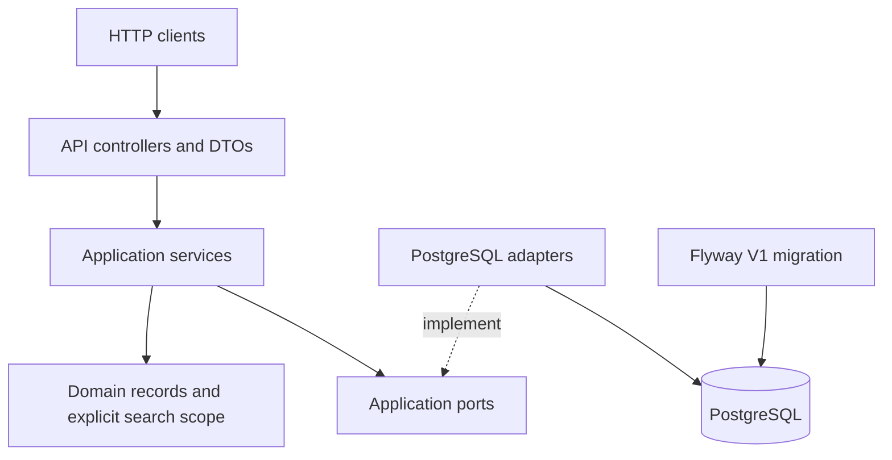
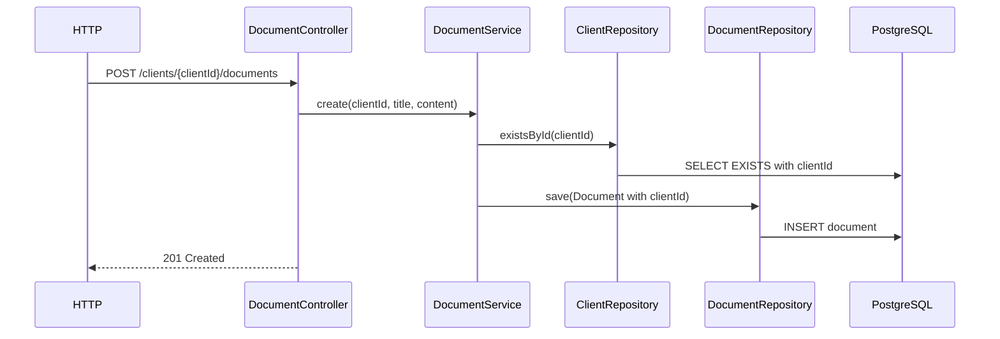
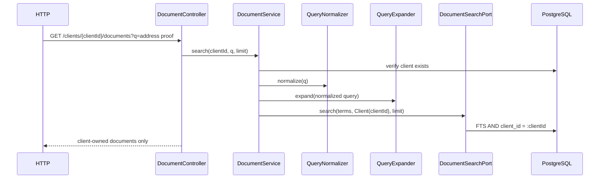

# Nevis Search Service — As-Built Architecture

> Status: implementation architecture as of 2026-08-17.
>
> The original agreed plan is preserved unchanged in
> [`IMPLEMENTATION_PLAN.md`](IMPLEMENTATION_PLAN.md). This document describes the code that actually
> exists in the repository.

## 1. Implemented scope

The service implements:

- client creation;
- creation of text documents owned by a client;
- listing and full-text searching of one client's documents;
- global client and document search through a typed result array;
- deterministic client discovery by name, email, and company-like email-domain queries;
- deterministic business-term expansion backed by PostgreSQL;
- Flyway-managed PostgreSQL schema and seed data;
- OpenAPI/Swagger documentation;
- Docker Compose runtime configuration;
- unit tests and PostgreSQL/Testcontainers integration tests.

The optional document-summary capability was not implemented. No functionality from the plan's
non-goals was introduced.

## 2. Technology baseline

| Area | Implemented choice |
|---|---|
| Language | Java 25 |
| Framework | Spring Boot 4.1.0 / Spring Framework 7 |
| Build | Maven |
| HTTP | Spring MVC with embedded Tomcat |
| Database access | Spring `JdbcClient` |
| Source of truth | PostgreSQL 17.6 image in local/test configuration |
| Schema management | Flyway |
| Document search | PostgreSQL FTS (`tsvector`, `websearch_to_tsquery`, `ts_rank_cd`) |
| API documentation | springdoc-openapi 3.0.3 / Swagger UI |
| Database tests | Testcontainers 2.0.5 with PostgreSQL 17.6 |
| Local orchestration | Docker Compose |

## 3. Architecture overview

The code is a lightweight ports-and-adapters application. Spring dependency injection performs the
runtime wiring, but application services depend only on application ports and domain types.



Dependency direction in source code:

```text
api -> application -> application.port + domain
infrastructure.postgres -> application.port + domain
```

The `application`, `domain`, and `api` packages do not contain SQL or import `JdbcClient`.
PostgreSQL-specific FTS syntax remains under `infrastructure.postgres` and in Flyway migrations.

## 4. Package and component map

### `com.nevis.search.api`

| Component | Responsibility |
|---|---|
| `ClientController` | `POST /clients` |
| `DocumentController` | document creation, client-scoped list, client-scoped search |
| `SearchController` | global client/document search facade |
| `ApiExceptionHandler` | consistent `400`, `404`, and safe `500` responses |
| `api.dto` | validated request DTOs and external response models |

API DTOs are separate from domain records. Global search uses the sealed
`SearchResultResponse` hierarchy with the `CLIENT` / `DOCUMENT` discriminator.

### `com.nevis.search.application`

| Component | Responsibility |
|---|---|
| `ClientService` | creates clients and delegates persistence |
| `DocumentService` | verifies client existence, creates/lists documents, enforces client scope |
| `SearchService` | orchestrates global client and all-client document search |
| `QueryNormalizer` | canonicalizes and validates raw queries |
| `QueryExpander` | combines the original query with explicit related business terms |

`ClientNotFoundException` and `InvalidRequestException` represent expected application failures.

### `com.nevis.search.application.port`

| Port | Capability |
|---|---|
| `ClientRepository` | client persistence and existence checks |
| `DocumentRepository` | document persistence and client-scoped listing |
| `ClientSearchPort` | ranked client discovery |
| `DocumentSearchPort` | ranked document search for an explicit scope |
| `QueryExpansionPort` | lookup of related business terms |

CRUD and search remain separate capabilities even though PostgreSQL currently implements both.

### `com.nevis.search.infrastructure.postgres`

| Adapter | Implementation detail |
|---|---|
| `PostgresClientRepository` | JDBC client inserts/lookups |
| `PostgresDocumentRepository` | JDBC document inserts/lookups and explicit client list query |
| `PostgresClientSearchAdapter` | normalized relational matching and deterministic ranking |
| `PostgresDocumentSearchAdapter` | PostgreSQL FTS, ranking, and scope predicate |
| `PostgresQueryExpansionAdapter` | group lookup in `search_term_mapping` |

## 5. Domain model and ownership

The implemented domain records are:

```text
Client
  id: UUID
  firstName: String
  lastName: String
  email: String
  countryOfResidence: String?

Document
  id: UUID
  clientId: UUID
  title: String
  content: String
  createdAt: Instant
```

Every `Document` carries a non-null `clientId`. The database foreign key guarantees that the owner
exists.

Document-search scope is an explicit sealed type:

```text
DocumentSearchScope
  AllClients
  Client(clientId)
```

There is no Tenant entity, hidden client context, `ThreadLocal`, authentication scope, RLS, or
database-per-client routing.

## 6. PostgreSQL schema

`V1__initial_schema.sql` is the sole owner of the initial schema.

### `clients`

- UUID primary key;
- bounded first name, last name, email, and optional country;
- email is deliberately not unique because the task did not define that invariant.

### `documents`

- UUID primary key;
- mandatory `client_id` foreign key to `clients`;
- title, text content, and `TIMESTAMPTZ` creation time;
- stored generated `search_vector`;
- title tokens have weight `A` and content tokens have weight `B`;
- GIN index on `search_vector`;
- B-tree index on `client_id`.

The generated expression uses the PostgreSQL `english` text-search configuration.

### `search_term_mapping`

The table has `group_key`, `term`, and `normalized_term`, with a primary key on
`(group_key, normalized_term)`. Flyway seeds one `proof_of_address` group:

```text
address proof
proof of address
proof of residency
utility bill
bank statement
```

Adding a term requires one row rather than pairwise synonym mappings.

## 7. Search design

### 7.1 Query normalization

`QueryNormalizer`:

1. rejects null or blank input;
2. trims and lowercases with `Locale.ROOT`;
3. converts `-`, `_`, `/`, and `\` separators to spaces;
4. collapses repeated whitespace;
5. requires at least one letter or digit;
6. enforces `MAX_QUERY_LENGTH`, default `200`.

Email punctuation (`@` and `.`) is retained so exact email matching remains possible.

### 7.2 Business-term expansion

`QueryExpander` always includes the normalized original term. The PostgreSQL expansion adapter
finds a matching mapping group and returns every term in that group. A `LinkedHashSet` deduplicates
the result. Expansion is one level only and performs no fuzzy or recursive inference.

### 7.3 Client search

`PostgresClientSearchAdapter` derives a compact alphanumeric query and compact email domain in SQL.
For example:

```text
Nevis Wealth -> neviswealth
anton.batiaev@neviswealth.com -> neviswealthcom
```

Candidates match exact email, compact domain, first name, last name, or full name. Ordering is:

1. exact full email;
2. exact/prefix compact domain;
3. name prefix;
4. other contains match;
5. last name, first name, and UUID as deterministic tie-breakers.

### 7.4 Document FTS

`PostgresDocumentSearchAdapter` binds every expanded term as a SQL parameter and converts it with
`websearch_to_tsquery('english', term)`. The terms are evaluated with OR semantics by matching each
document against all generated queries. The maximum `ts_rank_cd` value is used as that document's
relevance.

Ordering is relevance descending, creation time descending, then UUID.

For `DocumentSearchScope.Client(clientId)`, the same FTS query includes:

```sql
AND d.client_id = :clientId
```

`AllClients` omits that predicate and is used only by the required global search facade.

## 8. Request flows

### Create document



### Client-scoped document search



### Global search

`SearchService` normalizes once, calls `ClientSearchPort`, expands document terms, calls
`DocumentSearchPort` with `AllClients`, and returns the two result groups without inventing a shared
score. `SearchController` serializes client results first and document results second. The supplied
`limit` applies independently to each result type, so the response can contain up to twice that
number of items.

## 9. HTTP API as implemented

| Method and path | Behaviour |
|---|---|
| `POST /clients` | Creates and returns a client with `201` and `Location` |
| `POST /clients/{clientId}/documents` | Creates a client-owned text document |
| `GET /clients/{clientId}/documents` | Lists documents for one client; supports `limit` and `offset` |
| `GET /clients/{clientId}/documents?q=...` | Searches documents for one client; supports `limit` |
| `GET /search?q=...` | Searches clients and all-client documents; supports per-type `limit` |

The configured default limit is `20`, and the configured maximum is `100`.

Request validation includes bounded names, email syntax, bounded title, non-blank content,
configurable content size, non-blank searchable queries, maximum query length, valid UUIDs, and
valid pagination values.

Expected errors use `ApiError`:

```text
timestamp, status, error, message, path, violations[]
```

Malformed requests and validation failures return `400`. Unknown clients in document operations
return `404`. Unexpected failures return a generic `500`; the response does not expose SQL or stack
traces.

## 10. Configuration and runtime

`application.yml` maps environment variables for the datasource, server port, query limits, result
limits, and document content limit. Defaults target the Compose PostgreSQL service for the standard
local workflow.

`compose.yaml` defines:

- pinned `postgres:17.6-alpine` with a health check and persistent volume;
- an application image built by the repository `Dockerfile`;
- port `8080` for the service and `5432` for local database access;
- application startup after PostgreSQL becomes healthy;
- automatic Flyway execution during Spring Boot startup.

The Dockerfile is a multi-stage Java 25 build. The runtime process uses numeric non-root user
`10001`.

## 11. Testing architecture

Pure unit tests cover:

- normalization, separator handling, email preservation, blank/punctuation-only input, and maximum
  query length;
- expansion, original-term preservation, and deduplication;
- global-search orchestration and `AllClients` scope selection;
- client-scoped search propagation, unknown-client handling, and content-size enforcement.

`NevisPostgresIntegrationTest` uses a real PostgreSQL Testcontainer and covers:

- Flyway migrations, generated search vector, and foreign-key enforcement;
- company-domain, exact-email, and name client search;
- mapping-group expansion and negative expansion;
- PostgreSQL stemming, title weighting, ranking, and no-result behaviour;
- client-scope isolation versus intentional global scope;
- API creation, validation, malformed JSON, unknown client, typed global results, and empty results.

The integration class uses `disabledWithoutDocker = true`: environments with Docker execute it;
environments without Docker skip it instead of substituting H2.

Verification at the time this document was created:

- `mvn verify` builds the executable JAR successfully;
- 9 unit tests pass;
- 5 PostgreSQL/API integration tests compile but were skipped on the current workstation because
  Docker was not installed;
- a `docker compose up --build` smoke test therefore remains to be run in a Docker-enabled
  environment.

## 12. Plan-to-implementation notes

The implementation preserves the plan's boundaries. Equivalent concrete choices are:

- `DocumentSearchPort` receives the already expanded `Set<String>` plus explicit scope and limit;
  PostgreSQL query construction remains in the adapter;
- expanded alternatives use separate safe `websearch_to_tsquery` values and maximum matching rank,
  which provides the planned OR semantics without application-level `tsquery` construction;
- listing supports `limit` and `offset`; FTS and global search currently support `limit` only;
- Maven was selected because the empty repository had no pre-existing build tool;
- optional summarization was intentionally left out after the core implementation.

No unresolved discrepancy between the agreed architectural boundaries and the implementation is
known. The only incomplete verification item is the Docker-dependent integration/smoke execution
described above.

## 13. Deliberate non-goals

The repository does not implement:

- Tenant concepts, authentication, authorization, RLS, or database-per-client isolation;
- Elasticsearch, OpenSearch, Lucene, vectors, embeddings, or LLM search;
- file upload, binary storage, S3, PDF parsing, OCR, or asynchronous ingestion;
- Kafka, microservice decomposition, or an observability stack;
- optional document summarization.

Future search-engine replacement should implement `DocumentSearchPort`. Future business-taxonomy
storage should implement `QueryExpansionPort`. Neither change should require rewriting controllers
or application orchestration.
